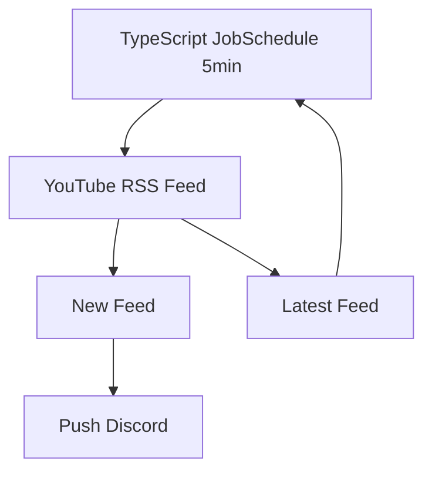

# 🎥 YouTube 新着動画通知Bot

自分で設定したYouTubeチャンネルの新着動画を定期的にチェックし、Discordに自動通知するBotです。

---

## 🧩 概要

YouTube RSSフィードを定期的に取得し、新しい動画が投稿された場合にDiscordへ通知します。  
Dockerコンテナ上で動作し、TypeScriptで実装されています。

**使用技術**

- Docker
- TypeScript (Node.js)
- RSS (YouTubeフィード)
- Discord API

---

## ⚙️ システム構成

- RSSを5分おきに取得して比較
    
- 新しい投稿があればDiscordの指定チャンネルに通知
    
- 永続データ(`LatestFeed`)で前回取得情報を保持
    

---

## 💬 Discordコマンド

|コマンド|説明|オプション|
|---|---|---|
|`/init`|通知チャンネルを登録します|-|
|`/addhook`|YouTubeチャンネルを通知対象に追加|`url`: チャンネルURL（例: https://www.youtube.com/@***）|
|`/removehook`|通知対象から削除|`url`: チャンネルURL|
|`/showhooks`|現在の登録リストを表示|-|
|`/deletesetting`|通知チャンネル設定を削除|-|

---

## ⚙️ 内部仕様

|項目|内容|
|---|---|
|RSS取得間隔|5分ごと|
|永続データ保存先|`/app/data/*.json` (Docker Volume)|
|Discord通知|Botトークン経由|

---
